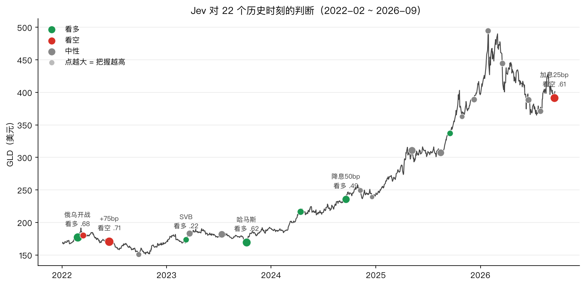
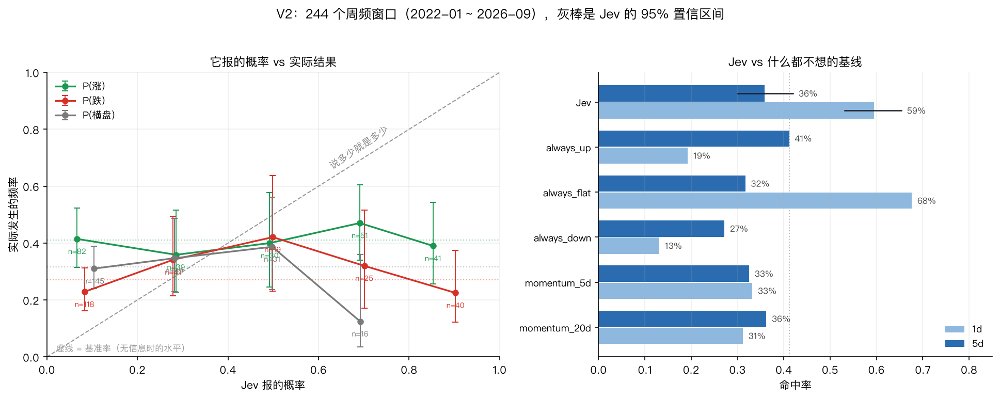

# jev-gold

> 我们要验证的是 Jev 在黄金上的投资判断能力。实验已经做完，结论是它无法胜任。

2026 年 9 月 16 日，美联储三年来第一次加息，点阵图还说年内要再加一次。教科书上这利空黄金。我们把当天的全球新闻、利率、金价喂给 Jev，它回答：看空，把握 61%。

第二天金价涨了 1.69%。

项目有条很死的规矩，把握不到八成不许动手，所以它那次只是看着，什么也没做。

一次可能是运气。所以我们把它做成了正经的验证：22 个历史事件窗，再加 244 个周频窗口，打分口径和比较组次事先登记好。跑完才确认，这不是运气问题。

Jev 是 TypeSafe 做的决策模型，不写文章，只吐概率。它宣传的核心是"认知诚实的概率"。这个项目就是拿黄金去验这句话。

## 结论

三条，每条都能用仓库里的脚本重跑出来。

方向判断没有超额信息。预测未来 5 个交易日的涨跌，它命中 36%（95% CI 30–42%），输给"永远看多"的 41%；预测 1 天，命中 59%，输给"永远说横盘"的 68%。

它报的概率不能按字面相信。说"八成会跌"的那些周，只有三成真的跌了。说"六成横盘"的时候只有四分之一横盘，而横盘本来就是最常出现的结果。

把握越大，命中越少。5 日口径下，把握 60% 以上的那批命中 29%，把握 40–60% 的反而有 44%。

预先登记的 10 组比较（2 个时间尺度 × 5 种市场环境切分），没有一组赢过基线，我们也没有回头换切法再找。对"Jev 能不能用来判断黄金走向"，答案是否定的。

## 我们测的是什么

一次针对 Jev 的能力验证。

它不预测金价，也没有交易以外的目标：给 Jev 一个和标签严格对齐的预测任务，看它报的概率和真实结果对不对得上。就这么一件事。

选黄金，是因为这块是空的。Jev 官方只公开"和其他模型答案的一致率"，没有独立测过准确率和校准；生态里那几个公开项目都是工程演示，方向判断占一个位置，没人验证过那个位置值不值钱。

结果是它不行。不过实验本身是完整的：数据链跑通、样本够大、口径事先登记、原始数据公开，任何人都能重跑一遍。不成立的是 Jev，不是这套方法。

## 它怎么工作

每 15 分钟，代码把全球冲突、利率、金价打包成一份状态，问 Jev 三个固定问题。把握超过八成才动纸面仓位，每次判断原样存进 SQLite。

| 问题 | 类型 | 问的是什么 |
|---|---|---|
| `geopolitical_risk` | 打分 0–3 | 现在的地缘冲突到什么级别，0 是风平浪静，3 是大国开战 |
| `news_direction` | 三选一 | 最近的新闻流整体利多黄金、利空黄金，还是说不清 |
| `fed_repricing` | 概率 0–1 | 这些新闻会不会改变市场对美联储路径的预期 |

门槛由代码管着，Jev 说了不算：看多、把握八成以上、风险至少 1 级，三条同时满足才开多；看空且把握八成以上就清仓；其他情况一律看着。不做空，全是纸面交易。

它没有世界知识，只认识我们喂进去的那份状态。这是优点，数据管线就是它的全部上下文，每次判断都能严格复现；也是坑，喂错数据它会自信地给错答案。所以这个项目里取数和校验的代码比判断的代码多得多。

一次三问大概 950 个 token，几分钱不到，跑一天也就几美分。

## 三个真实判断

### 美联储三年来第一次加息（2026-09-16）

当天的状态：10 年实际利率 2.62，美元指数 118.2，GLD 收 391.7（之前 5 天跌了 2.9%），全球冲突脉搏平稳。

Jev 给的概率分布是看空 74%、中性 21%、看多 5%，自己报的把握 61%。风险打分 1，觉得美联储路径没被实质改变（0.32）。教科书式的回答，合情合理。

然后市场没按教科书走。加息落地即出尽，次日 +1.69%。61% 没到 80% 的线，仓位没动，这个错误只留在了日志里。

### 俄乌全面开战（2022-02-24）

那天的状态很难看：冲突事件占了 19%，烈度均值 -7.5，实际利率还是负的。

Jev 把风险打到 3 级，满分，把握 85%。方向上给了看多，概率 78%，但把握只有 68%。没到线，没追多。

次日金价高开回吐 -0.33%，五天后 +2.07%。方向看对了，节奏没对。门槛让它躲过了第一天的回撤，也一分钱没赚到。

这是它发挥最好的一次，也是它离动手最近的一次。

### 它说看不清的时候（2026-07-29）

7 月 FOMC 按兵不动，但有三名委员投票反对、主张加息。Jev 给中性，把握 20%，概率分布也是一团：中性 47%、看空 37%、看多 16%。

之后五天金价涨了 5%。它没看清，这段涨幅就跟我们没关系了。门槛挡错过，也挡对过，两条都记下来，才谈得上校准。

## 两次实验

|  | 实验一（V1） | 实验二（V2） |
|---|---|---|
| 问法 | 三问：地缘风险 / 新闻方向 / 美联储预期 | 直接预测未来 1 日和 5 日方向 |
| 采样 | 22 个事件时点，2022-02 ~ 2026-09 | 每周三一次，246 窗，2022-01 ~ 2026-09 |
| 有效样本 | 22，全部真实 Jev | 244 |
| 结果 | 门控放行 0 次，没开过一次仓 | 10 组预登记比较全败，概率反校准 |

V1 是定点抽查，样本小，只够看个例；V2 是密集采样，才够下统计结论。两次指向同一个方向，所以下面的结论才敢写。

## 实验一（V1）：22 个事件窗

2022 年 2 月到 2026 年 9 月，挑了 22 个时刻，每个时刻只让它判断一次，然后看随后 1 天和 5 天的金价。点的颜色是它的方向判断，点的大小是它自报的把握。



| 日期 | 事件 | 判断 (把握) | 风险 | 操作 | 次日 % | 1d | 5d |
|---|---|---|---|---|---|---|---|
| 2022-02-24 | 俄乌开战 | 看多 (.68) | 3 | 没动 | -0.33 | 错 | 对 |
| 2022-03-16 | 首次加息 | 看空 (.28) | 2 | 没动 | +0.49 | 错 | 错 |
| 2022-06-15 | +75bp | 看空 (.71) | 1 | 没动 | +1.12 | 错 | 对 |
| 2022-09-26 | 北溪 | 中性 (.15) | 2 | 没动 | +0.21 | – | – |
| 2023-03-10 | SVB | 看多 (.22) | 1 | 没动 | +2.30 | 对 | 对 |
| 2023-03-22 | FOMC | 中性 (.30) | 1 | 没动 | +1.25 | – | – |
| 2023-07-12 | 平静期 | 中性 (.39) | 1 | 没动 | +0.07 | – | – |
| 2023-10-07 | 哈马斯 | 看多 (.62) | 2 | 没动 | -0.17 | 错 | 对 |
| 2024-04-13 | 伊朗-以色列 | 看多 (.32) | 2 | 没动 | +0.12 | 错 | 错 |
| 2024-09-18 | 降息50bp | 看多 (.49) | 1 | 没动 | +1.55 | 对 | 对 |
| 2024-11-07 | 降息25bp | 中性 (.13) | 1 | 没动 | -0.68 | – | – |
| 2024-12-18 | 降息25bp | 中性 (.07) | 1 | 没动 | +0.14 | – | – |
| 2025-05-07 | 维持 | 中性 (.44) | 1 | 没动 | -1.97 | – | – |
| 2025-08-15 | 平静期 | 中性 (.40) | 1 | 没动 | -0.16 | – | – |
| 2025-09-17 | 降息25bp | 看多 (.23) | 1 | 没动 | -0.40 | 错 | 对 |
| 2025-10-29 | 降息25bp | 中性 (.12) | 1 | 没动 | +1.96 | – | – |
| 2025-12-10 | 降息25bp | 中性 (.22) | 1 | 没动 | +1.08 | – | – |
| 2026-01-28 | 维持 | 中性 (.20) | 1 | 没动 | +0.27 | – | – |
| 2026-03-18 | 维持 | 中性 (.21) | 1 | 没动 | -4.12 | – | – |
| 2026-06-17 | 维持 | 中性 (.28) | 1 | 没动 | -0.38 | – | – |
| 2026-07-29 | 维持(3票异议) | 中性 (.20) | 1 | 没动 | +1.64 | – | – |
| 2026-09-16 | 加息25bp | 看空 (.61) | 1 | 没动 | +1.69 | 错 | 未到期 |

把中性和还没到期的刨掉，方向判断次日 2 对 7 错，5 日 6 对 2 错。按把握分桶：

| 把握 | 次数 | 次日对 |
|---|---|---|
| 0–40% | 4 | 1 |
| 40–60% | 1 | 1 |
| 60–80% | 4 | 0 |
| 80%+ | 0 | 0 |

几个值得说的地方。

它从来没给过 80% 以上的把握，俄乌开战那天也只有 68%。所以至今一次仓都没开过，账户约等于现金。

60–80% 这一档次日全错。这是它最自信的时候（仅次于从没出现过的 80%+），四次全错。当时我们想的是"样本太少，别下结论"，后面的 244 个窗口证实了这个方向。

## 实验二（V2）：244 个周频窗口

22 个事件窗说明不了什么，所以做了第二轮：2022 年 1 月到 2026 年 9 月，每周三问一次，让 Jev 直接预测"未来 5 个交易日涨超 1%、跌超 1%、还是横盘"。问题和标签完全对齐，244 个有效样本，配三个傻瓜基线对照。



左图是校准：横轴是 Jev 自己报的概率，纵轴是实际发生的频率，灰色对角线代表"说多少就是多少"。三条线本该贴着对角线往上走，实际是一条条趴在对角线下方，而且基本是平的。虚线是基准率，也就是完全不做判断、永远押同一个答案时的水平。右图是命中率对比，黑线是 Jev 的 95% 置信区间。

### 方向：打平动量，输给"永远看多"

| 5 日方向 | 命中率 |
|---|---|
| Jev | 36%（95% CI 30–42%） |
| 永远看多 | 41% |
| 20 日动量 | 36% |
| 5 日动量 | 33% |

Jev 打平 20 日动量，输给"永远看多"。拆开看更清楚：它说看多的 114 次命中 43%（看多的基准率本来就是 41%），说看空的 84 次命中 30%（基准率 27%），说横盘的 45 次命中 29%（基准率 32%）。每个类别都贴着基准率走，预测里没有超额信息。

1 日口径一样：Jev 59%，"永远说横盘"是 68%。它的置信区间（53–65%）整个落在基线之下，所以这里不是"没赢"，是明确地更差。

### 概率：报多少都不能信

把它的自报概率按高低分五档，看每一档实际发生了多少次：

| Jev 报 P(下跌) | 次数 | 实际跌的频率 |
|---|---|---|
| 8% | 118 | 23% |
| 28% | 41 | 34% |
| 50% | 20 | 45% |
| 71% | 24 | 29% |
| 90% | 40 | 22% |

它报"九成会跌"的 40 次，实际跌 22%；报"只有 8% 会跌"的 118 次，实际跌 23%。两端的实际结果几乎一模一样。这不是概率偏了几档，是概率和结果之间没有关系。

上涨那条更极端：报 7% 的 82 次实际涨 41%，报 85% 的 41 次实际涨 39%。从 7% 到 85%，实际频率纹丝不动，一直停在基准率 41% 附近。横盘那条则反着来：报 10% 的 145 次实际横盘 31%，报 69% 的 16 次只有 12% 横盘。它越是笃定"什么都不会发生"，市场越容易出大行情。

再看置信度和正确率的关系，同样是反的：

| 自报把握 | 5 日命中 |
|---|---|
| 60% 以上 | 29% |
| 40–60% | 44% |
| 40% 以下 | 41% |

把握最高的那批最不准。这跟上面 V1 里"60–80% 全错"是同一件事在两个样本上的复现。

按规矩交代：比较是预先登记的，共 10 组（2 个时间尺度 × 5 种切法，含高冲突、实际利率上行、风险评分≥2 等切分），没有一组赢基线。

还有一处得自己招。相邻周的窗口是重叠的，同一段行情会被算进好几个 5 日标签里，所以 244 个样本不等于 244 个独立样本，有效样本量得打折。打折之后，"比基线低几个点"这类差距就不够显著了，上面那两张命中率表该当方向性证据看，不是定论。真正不吃样本量的是概率那一组：报九成跌的事实际只跌了两成，这个偏离太大，样本砍到五分之一还是远在噪声之外。下面的结论主要压在它上面。

## 它输在哪里

两次实验合起来，可以压成一张表。

| 来自 | 测的是什么 | 结果 |
|---|---|---|
| V1 | 门槛放行次数 | 0 次，四年一笔单没下 |
| V1 | 把握 60–80% 的次日方向 | 0 对 4 |
| V2 | 5 日方向 vs 三个傻瓜基线 | 36%，输给"永远看多"41%，打平 20 日动量 |
| V2 | 1 日方向 | 59%，输给"永远说横盘"68%，置信区间上界也不够 |
| V2 | 它报的概率 | 报九成跌的，实际跌两成；报 8% 跌的，实际跌 23% |
| V2 | 把握越大是否越准 | 反的。60% 以上命中 29%，40–60% 命中 44% |

前四行说的是方向判断不行，最后两行说的是概率本身不能用。中间插一句：这套风控确实没让一个不行的判断把钱亏掉，换个角度看也是讽刺——从"交易系统"的标准衡量，这个项目从头到尾没有交易过，账户约等于一直拿着现金，唯一的作用是证明了它不该动。

这就是这次实验的结论：Jev 无法胜任黄金的投资判断。

## 结论的适用边界

三处边界交代清楚，免得被误读。

喂给它的信息很薄。244 个历史窗里，GDELT 拿不到当年的新闻原文，Jev 只看到十几个数字：几段价格动量、实际利率、美元指数、冲突占比和烈度、距下次 FOMC 天数。我们测的是"只看数字摘要的 Jev"，不是官方演示里"读完新闻再判断的 Jev"。它没有世界知识，喂什么才知道什么，这是本次实验最大的限制。

只测了黄金的 1 日和 5 日方向。更长周期、其他品种、非预测类的用法（比如把新闻归成风险等级）都没测。风险分级它在俄乌那天给了满分 3 级、85% 把握，看起来合理，但我们没有拿统计去验过。

金价短期方向本身接近噪声。也可能换谁来都赢不了，所以"Jev 不行"和"这题没解"分不开。

边界之内，结论是硬的：这个任务上，它报的概率不能用来做投资判断。边界之外，我们不替它下结论。

## 自己跑一遍

要两个 key：Jev 走 [Vercel AI Gateway](https://vercel.com/ai-gateway)（模型 `typesafe-ai/jev`，按量付费），宏观数据用 [FRED](https://fred.stlouisfed.org/docs/api/api_key.html)（免费申请）。没有 key 也能跑通管线，把 `JEV_GOLD_JUDGE` 设成 `mock` 就行。

```bash
python3.11 -m venv .venv && source .venv/bin/activate
pip install -e .
cp .env.example .env      # 填两个 key
python -m jev_gold.loop --once        # 跑一拍：取数 → 判断 → 存库
python -m jev_gold.backtest --resume     # 实验一：22 个历史时刻，--resume 不重复调用
python -m jev_gold.weekly_eval --resume  # 实验二：246 个周频窗口，约 50 分钟、$0.01
python -m jev_gold.chart                 # 画实验一那张图
python -m jev_gold.calibration_chart     # 画实验二那张图
python -m unittest discover -s tests     # 43 项测试，不花 API 的钱
```

两张图的数字都直接从 `reports/*.json` 读，不手抄。跑完 244 窗以后，结果落在 `reports/weekly_eval.json`，同一目录下还有一份带原始计数和 Wilson 区间的 `weekly_eval.md`（`reports/` 没有入库，跑完就有）。觉得数字有问题的话，欢迎拿它来挑错。

所有操作都是纸面的，不构成投资建议。
